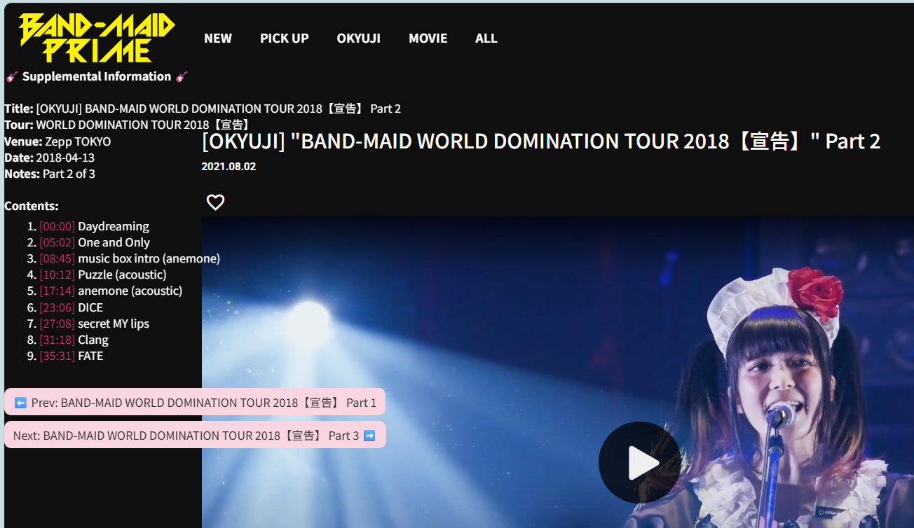

# BAND-MAID Prime Video Describer

A [TamperMonkey](https://www.tampermonkey.net/) userscript that adds detailed information to [BAND-MAID PRIME](https://bandmaidprime.tokyo/) video pages.



---

## 🧩 What It Does

This userscript automatically adds an overlay on applicable BAND-MAID PRIME videos showing:

- 🎸 **Okyuji setlist** — song names (or content descriptions) and their timestamps  
- 🗓️ **Tour, venue, and date** information  
- 🔗 **Next / Previous part navigation** for multi-part Okyuji videos or navigating a series (BTS)
- 💬 Contextual notes (e.g., “Part 2 of 3 from the Zepp Tokyo performance”)  

The overlay updates dynamically when switching between videos — no page reload required. The overlay goes away in full screen mode.

It also adds a Search Bar on all Prime videos. The Search Bar is at the very bottom so you'll have to scroll down to see it. You can search for strings in the title or category (i.e. BTS, okyuji, etc). All matches are clickable.

---

## ⚙️ Installation

1. **Install TamperMonkey**
   - Chrome / Edge: [TamperMonkey Extension](https://tampermonkey.net/?ext=dhdg&browser=chrome)
   - Firefox: [TamperMonkey Add-on](https://tampermonkey.net/?ext=dhdg&browser=firefox)
   - Also supported on Safari and Opera.

2. **Install the Script**
   - Visit the [raw URL of the script](https://drivetimebm.github.io/BAND-MAID_prime/scripts/bandmaidprime.user.js) file in this repository:  

     ```HTML
     https://drivetimebm.github.io/BAND-MAID_prime/scripts/bandmaidprime.user.js
     ```

   - TamperMonkey will prompt you to install it.  
     Click **Install**.

3. **That’s it!**
   - Visit any okyuji video (and select others) on [BAND-MAID PRIME](https://bandmaidprime.tokyo).
   - The script will automatically display the Okyuji info below the video title.
   - Here's a catalog of Prime videos (with links) organized by category: [BAND-MAID Catalog](https://drivetimebm.github.io/BAND-MAID_reports/Reports/Band-Maid%20Prime.pdf).

---

## 🧠 Notes

Timestamp links are compatible with HTML5 players, but the Uliza player used on BAND-MAID PRIME ignores them.
They’re displayed for reference only and don’t interfere with playback.

The overlay automatically updates when navigating between video parts.

## 🗂️ Data Source

Setlist and metadata are stored in: [data/setlists.json](https://drivetimebm.github.io/BAND-MAID_prime/data/setlists.json)

Each entry includes:

```json
{
  "59927": {
    "title": "[OKYUJI] BAND-MAID WORLD DOMINATION TOUR 2018【宣告】 Part 2",
    "tour": "WORLD DOMINATION TOUR 2018【宣告】",
    "venue": "Shinkiba STUDIO COAST",
    "date": "2018-04-15",
    "notes": "Part 2 of 3 from the Tokyo performance.",
    "setlist": [
      { "time": "00:00", "song": "DOMINATION" },
      { "time": "04:52", "song": "Play" },
      ...
    ],
    "previous": "59926",
    "next": "59928"
  }
}
```

---

## All BAND-MAID Projects

- [BAND-MAID X/Twitter Archive](https://github.com/DriveTimeBM/BAND-MAID_tweets)
- [BAND-MAID Song Sorter (Ranker)](https://github.com/DriveTimeBM/BAND-MAID_song_sorter)
- [BAND-MAID GIF Catalog](https://github.com/DriveTimeBM/BAND-MAID_gifs)
- [BAND-MAID Reports](https://github.com/DriveTimeBM/BAND-MAID_reports)
- [BAND-MAID Instagram Archive](https://github.com/DriveTimeBM/BAND-MAID_instagram)
- [BAND-MAID GPT](https://github.com/DriveTimeBM/BAND-MAID_gpt)
- [BAND-MAID Prime Metadata](https://github.com/DriveTimeBM/BAND-MAID_prime)
- [BAND-MAID Creations](https://github.com/DriveTimeBM/BAND-MAID_creations)
- [BAND-MAID Setlists (Okyuji)](https://github.com/DriveTimeBM/BAND-MAID_okyuji)
- [BAND-MAID Translations](https://github.com/DriveTimeBM/BAND-MAID_translations)
- [BAND-MAID Songs](https://github.com/DriveTimeBM/BAND-MAID_songs)
